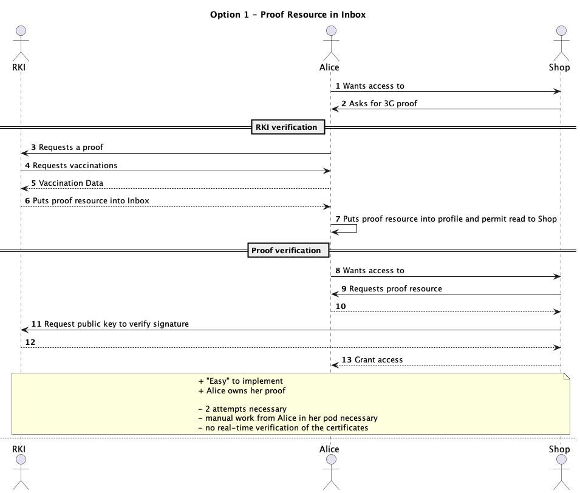
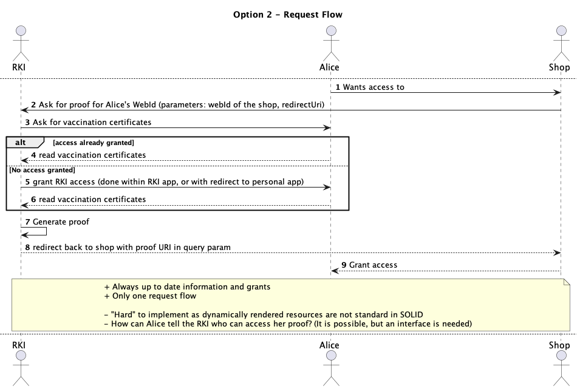
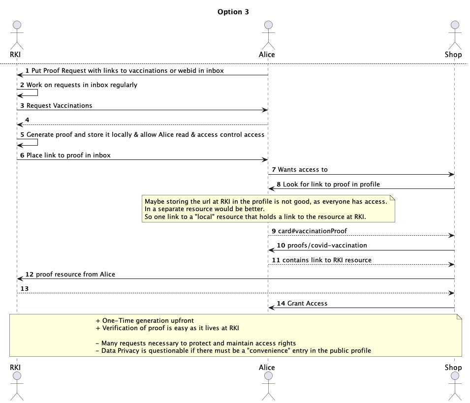

# Solid App: Verifiable-Credentials

The goal of the app is to provide documents while maintaining a maximum of security while only providing the minimum
required information.

This is app deals with managing personal authentication documents like ID card and vaccination certificates within a
personal SOLID pod.
It allows to share the information with third parties in order to verify eligibility for a certain service offered by
the third party (e.g. minimum age requirements, vaccination status). The shared information can be precisely selected
for each provider to limit the amount of shared data to a minimum. To further increase data privacy, it will incorporate
a mechanism to let information be verified by a trusted third party authority. Therefore, only sharing the authorization
status, derived by the third party and not the actual user data. Permissions on personal data within the personal pod
and derived certificates at third party authorities can be managed (e.g. granted, revoked, broadened) at any time by the
owning user.

## Context

This app is a Solid Application for the Hot Topics Seminar at the Chair of Technical Information Systems at FAU
Erlangen-Nuremberg and is supervised by Daniel Schraudner.

## Mission

After looking at SOLID, we wanted to build a demo application that uses SOLID's core strengths most closely to its
founding ideas. We want to show, that ownership of documents can be proven without revealing their content and
sacrificing privacy. Our long-term goal is to add another security layer to prevent the copying of users' data while
maintaining verifiable authenticity & integrity.

## Scope

The SOLID application should focus on a Proof-of-Concept. Therefore, sacrificing UI and UX for technical proofs and
development efficiency.

### Milestone 1

- Document management within the personal pod
- Sharing a documents with a third party
- Providing two views (one for the user and one for the inquirer)

### Milestone 2

- Selectively share data with a third party

### Milestone 3

- Proof authenticity of documents and shared data

### Milestone 4

- Implement a third party authority to derive verifiable, aggregated data (e.g. Vaccination status based on vaccination
  certificates, adult age proof based on birthdate)
- Adding a third view for the third party authority

### How to start the apps

Install the dependencie.

```bash
npm install
```

Start all the frontends and the backend each in a separate terminal:

```bash
nx run rki:serve
nx run shop:serve
nx run solvercred:serve
nx run rki-proof-generation:serve
```

Open the browser to http://localhost:4200 to manage your vaccination certificates.
Open the browser to http://localhost:4202 to access the shop and run through the verification process.

### Demarcation

The origin and input of the personal data is only conceptually part of the project and will not be reflected in the
implementation.
Possible usages or abstraction of the functionality (e.g. as a sdk) is not part of the implementation but will be
discussed as part of a though-experiment within the documentation.
We will not work with real third parties or authorities but will simulate their roles within our project.

## Roadmap

We will develop the Milestones consecutively and incrementally to provide a working sample at any time.

## User Stories

User Stories follow our Milestones with increasing complexity and interactivity.

- As user, I want to log in to the app with my WebID, so that I can manage my documents.
- As user, I want to add documents, so that they are stored in my app/pod.
- As user, I want to see the stored documents from my pod in a list, so that I can have an overview over my documents.
- As user, I want to remove documents from my app/pod, so that the data is no longer contained in the app/pod.
- As ... , I want to ..., so that

## Open Questions

- Regarding Milestone 3: Can we verify the authenticity & integrity without a third party? The signed document will
  probably only be signed as a whole and does not provide sub-certificates for each field. Thus, we cannot proof the
  integrity of a single field to a client ???

## Domain Glossary

- user: personal user that owns the documents
- inquirer: entity that wants to access verified data from the user
- authority: entity that has access to documents from the user and can verify an accumulated state (e.g. vaccination
  status) to an inquirer.
- app: Verifiable-Credentials Application
- document: RDF datasets that describe e.g. vaccination documents

## Design Decisions

### Grant Flow

During design of the app, we thought about different approaches how to proof a third party (e.g. a Shop) the fact, that
a person (Alice) is fully vaccinated, without granting access to the vaccination certificates themselves.
We came up with three options, which you can see below with their corresponding advantages and disadvantages:



---



---



After evaluation of all three options we decided for option 2, which is most convenient for the user and solves the
problem of authenticity of the proof in a simple way, as the proof is stored at the RKI's pod at a trusted domain.
The option contains several key elements:

#### Grant request flow

The user does not leave a directed flow, which leads towards his goal: access to the Shop.
The user is redirected to the next required step and if the step succeeds, he is redirected back to the original
application (Shop).
These redirects are communicated through query params. After being redirected back to the shop, the redirect uri also
contains the URi of the proof as a request param.

#### Authenticity of the Proof

The authenticity of the proof is easily verifiable as the proof always remains in the pod of the RKI. Therefore, one
could easily check origin URL, to be a valid RKI URL and check the corresponding SSL certificate of the https connection
with certificate pinning.

This means, that no complicated signature mechanisms (besides the ssl certificate check) are required to proof the
authenticity of the proof.

#### Renewal of Information

Due to the easy user flow, the proof certificate can have a lifetime of only a few hours / days and can easily be
regenerated without any effort for the user (Alice). This allows for fast revocation of certificates in case of fraud or
changing legal conditions.

#### IMPORTANT ASSUMPTION

For the time being, ACLs only support to grant an application full access to the pod. This means, that if a user (Alice)
visits the Shop authenticated, the Shop could indeed read the original vaccination certificates. ACLs will in future
allow for partial access to the pod's data. This means, that this approach will be even more secure once this change
will become active.

Proof muss jedes Mal neu generiert werden, damit man nicht erkennen kann, ob der User schon einen Proof hat
